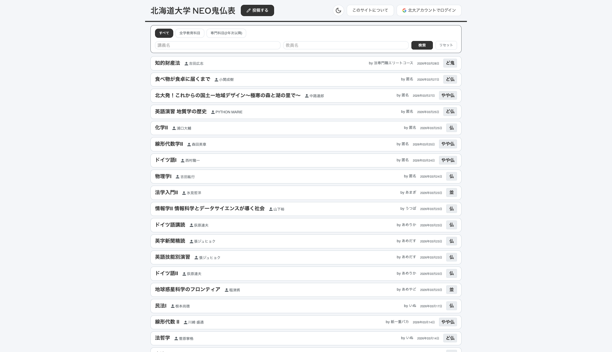
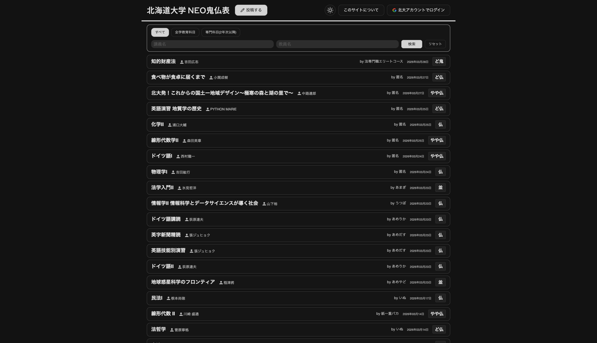

# neo鬼仏表

北海道大学の講義評価共有サイト。学生同士で講義の感想や評価を匿名で投稿・閲覧できます。

https://www.neokibutsu.net

| ライトモード | ダークモード |
|:---:|:---:|
|  |  |

## 技術スタック

- **フレームワーク:** Next.js 15 (App Router, TypeScript)
- **データベース:** Supabase (PostgreSQL)
- **ホスティング:** Vercel
- **スタイリング:** CSS

## セットアップ

```bash
npm install
cp .env.example .env.local  # 環境変数を設定
npm run dev                  # http://localhost:3000
```

## 主な機能

- 講義の評価投稿（匿名）
- 講義名・教員名での検索
- 科目区分フィルター（全学教育科目 / 専門科目）
- ブックマーク（北大アカウントでログイン）
- 通報・管理者への連絡
- 管理者ダッシュボード
- ダークモード
- PWA対応

## ライセンス

AGPL-3.0
